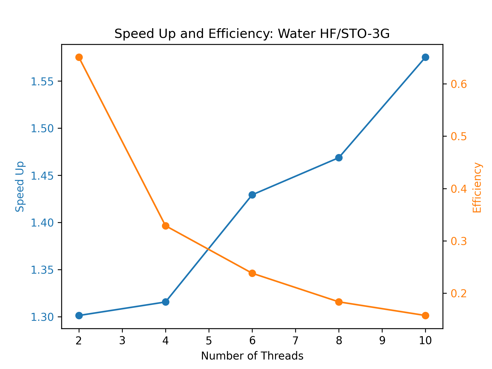
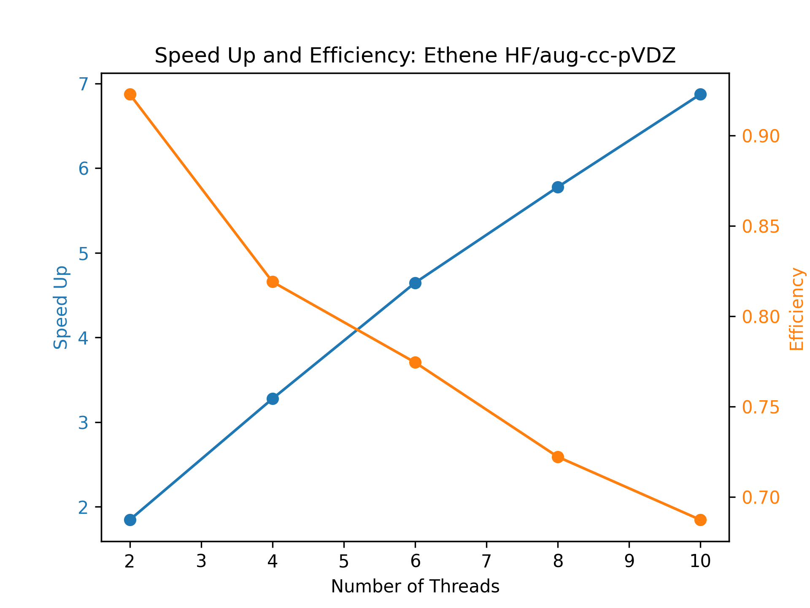

# Hartree-Fock Overview
The objective of Hartree-Fock (HF) is to solve the Schrodinger Equation through
the usage of optimizing coefficients for a linear combination of atomic
orbitals (LCAO) to create molecular orbitals that minimize the electronic
energy. Because this procedure depends on the electronic energy, the nuclear
energy is not added until the very end of the self-consistent field procedure
is complete. Within this procedure, orbitals can be optimized by minimizing the
electronic energy due to the varitaional theorem.

Effectively, this process relies on nuclear coordinates, charge, multiplicity,
and a basis set -- the present work uses atom-centered Gaussian functions to
describe atomic orbitals. From here, the overalp of atomic orbitals is computed
to forumlate S along with compiting kinetic (T) and potential (V) energy
intregals at the beginning. Next, the Core Hamiltonian is formed $H_{\mu\nu} =
T_{\mu\nu} + V_{\mu\nu}$. Before constructing the core Fock matrix (Equation 1) for a naive initial density matrix guess (Equation 3),
one must orthogonalize $S^{-1/2}$ through diagonalizing S and transforming 
to $S^{-1/2}$.
\begin{equation}
F_0' = (S^{-1/2})^\dagger H S^{-1/2}
\end{equation}
Through diagonlizing the core Fock matrix with the orthogonalized basis, one
can construct $C_0$.
\begin{equation}
C_0 = S^{-1/2}C_0'
\end{equation}

Using these sorted eigenvectors, we compute our density guess.
\begin{equation}
D_{\mu\nu} = \sum_{i}^{N/2} C_{\mu i} C_{\nu i}
\end{equation}
With these inital values, the SCF procedure may begin, where we iteratively compute a new
Fock matrix (Equation 4), compute electronic energy (Equation 5), transform
Fock matrix to the orthonormal basis (Equation 6), diagonlaize F, (Equation 7) update C (Equation 8), and
update the density (Equation 9) until converging the energy.
\begin{equation}
F_{\mu\nu} = H_{\mu\nu} + \sum_{\rho\sigma}^{AO}D_{\rho\sigma}{2 [\mu\nu| \rho\sigma] - [\mu\rho | \nu\sigma]}
\end{equation}
\begin{equation}
E = \sum_{\mu\nu}^{AO} D_{\mu\nu} (H_{\mu\nu} + F_{\mu\nu})
\end{equation}
\begin{equation}
F' = (S^{-1/2})^\dagger F S^{-1/2}
\end{equation}
\begin{equation}
C'^\dagger F' C' = \epsilon
\end{equation}
\begin{equation}
C = S^{-1/2} C'
\end{equation}
\begin{equation}
D_{\mu\nu} = \sum_{i}^{N/2} C_{\mu i} C_{\nu i}
\end{equation}
At the end of each iteration, convergence is checked by computing the energy
and comparing with the previous iteration and comparing with a user defined
threshold to break the iterative process. Once below the threshold, the
electronic energy is added to the nuclear energy to get the HF energy.

# Specific Implementation Details
I have implemented the abstract described HF procedure above in C++ through the
usage of Eigen3 for performing linear algebra operations with Lapack under the
hood. C++ was selected due to having strong support with OpenMP and MPI for
parallelization and to improve fundamental knowledege for aspring to become a
Psi4 developer.

The project allowed me to learn how to create my own cmake files for building
the library across OSX and Ubuntu with ease using the
[pitchfork](https://api.csswg.org/bikeshed/?force=1&url=https://raw.githubusercontent.com/vector-of-bool/pitchfork/develop/data/spec.bs)
convention. Using CMakeLists.txt took some initial learning but provides a
seamless path for finding libraries and repeatedly building the project during
development. Additionally, it makes it easier for others to know what is needed
for getting the project to run on their own machine. 

The initial test case for getting the library working follows the "Coding
Strategy #1" from canvas; however, the T, V, S, and ERI sections were broken
into separate files for a simplier parsing function to generate Eigen::MatrixXd
objects. For the larger system testing, the input data is generated with Psi4
through the Python3 API. The Eigen library provided an easy option for solving
for eigenvalues and eigenvectors through passing your matrix to the
SelfAdjointEigenSolver object initialization. The eigenvectors and eigenvalues
already returned sorted and have methods to reverse the sorting if needed.

# Code
The project is available on
[GitHub](https://github.com/Awallace3/HF/tree/master/cpp),
where I plan to continue to implement parallelization
towards a distributed HF code.

The most important files are `hf.cpp`, `input.cpp`, and
`helper.cpp` which are displayed below. Also, the data generator
for other systems is seen in the `main.py` file.

### hf.cpp
```cpp
#include "helper.hpp"
#include "input.hpp"
#include "omp.h"
#include "stdio.h"
#include <Eigen/Dense>
#include <ctime>
#include <fstream>
#include <iostream>
#include <string>
#include <vector>

using namespace std;

void HF_og() {
  // Specify Data Path
  /* std::string dataPath = "data/t1"; */
  std::string dataPath = "data/t0";
  double t1 = 1e-8, t2 = 1e-8;

  // Make pointers to store input data
  int num_atoms;
  double E = 0, e_nuc = 0;
  std::vector<int> *elements = nullptr;
  std::vector<double> *eri = nullptr;

  Eigen::MatrixXd *coords = nullptr;
  Eigen::MatrixXd *T = nullptr;
  Eigen::MatrixXd *V = nullptr;
  Eigen::MatrixXd *e1 = nullptr;
  Eigen::MatrixXd *S = nullptr;

  // Read Data
  input::gatherData(dataPath, num_atoms, &elements, &eri, &coords, &T, &V, &e1,
                    &S, &e_nuc);
  cout << "e_nuc: " << e_nuc << endl;

  // Starting HF Code
  // Allocate Memory for Matrices
  Eigen::MatrixXd *H = nullptr;
  Eigen::MatrixXd *S_12 = nullptr;
  Eigen::MatrixXd *F = nullptr;
  Eigen::MatrixXd *C = nullptr;
  Eigen::MatrixXd *C_0_prime = nullptr;
  Eigen::MatrixXd *D = nullptr;

  // Allocate memory for energy and electron count
  int num_electrons;

  // Set Number of Electrons for a Neutral Molecule
  helper::getNumberOfElectrons(num_atoms, elements, &num_electrons);

  H = new Eigen::MatrixXd(T->rows(), T->cols());
  *H = *T + *V;
  cout << endl << "H Matrix: " << endl << endl << *H << endl;

  // Orthogonalization of S
  cout << endl << "S Matrix: " << endl << endl << *S << endl;
  S_12 = new Eigen::MatrixXd(S->rows(), S->cols());
  helper::orthoS(S, S_12);
  cout << endl << "S_12 Matrix: " << endl << endl << *S_12 << endl;

  // Build initial Fock Matrix
  F = new Eigen::MatrixXd(H->rows(), H->cols());
  *F = (*S_12).transpose() * *H * (*S_12);
  cout << endl << "F Matrix: " << endl << endl << *F << endl;

  C_0_prime = new Eigen::MatrixXd(H->rows(), H->cols());
  helper::getC_0_prime(F, C_0_prime);
  cout << endl << "C_0_prime Matrix: " << endl << endl << *C_0_prime << endl;

  C = new Eigen::MatrixXd(H->rows(), H->cols());
  *C = (*S_12) * (*C_0_prime);
  cout << endl << "C Matrix: " << endl << endl << *C << endl;

  D = new Eigen::MatrixXd(H->rows(), H->cols());
  helper::updateDensityMatrix(C, D, num_electrons);
  cout << endl << "D Matrix: " << endl << endl << *D << endl;

  helper::SCF(eri, S_12, H, F, C, D, C_0_prime, num_electrons, &E, e_nuc, t1,
              t2);
  E += e_nuc;
  cout.precision(15);
  cout << endl << "Final HF Energy: " << E << endl;

  // Free Allocations
  free(elements);
  free(coords);
  free(T);
  free(V);
  free(e1);
  free(S);
  free(eri);
  printf("\nFreed Memory\n");
}

void HF(int num_atoms, double E = 0, double e_nuc = 0,
        std::vector<int> *elements = nullptr,
        std::vector<double> *eri = nullptr, Eigen::MatrixXd *coords = nullptr,
        Eigen::MatrixXd *T = nullptr, Eigen::MatrixXd *V = nullptr,
        Eigen::MatrixXd *S = nullptr

) {
  // Specify Data Path
  double t1 = 1e-8, t2 = 1e-8;

  // Starting HF Code
  // Allocate Memory for Matrices
  Eigen::MatrixXd *H = nullptr;
  Eigen::MatrixXd *S_12 = nullptr;
  Eigen::MatrixXd *F = nullptr;
  Eigen::MatrixXd *C = nullptr;
  Eigen::MatrixXd *C_0_prime = nullptr;
  Eigen::MatrixXd *D = nullptr;

  // Allocate memory for energy and electron count
  int num_electrons;
  // Set Number of Electrons for a Neutral Molecule
  helper::getNumberOfElectrons(num_atoms, elements, &num_electrons);

  H = new Eigen::MatrixXd(T->rows(), T->cols());
  *H = *T + *V;
  /* cout << endl << "H Matrix: " << endl << endl << *H << endl; */

  // Orthogonalization of S
  /* cout << endl << "S Matrix: " << endl << endl << *S << endl; */
  S_12 = new Eigen::MatrixXd(S->rows(), S->cols());
  helper::orthoS(S, S_12);
  /* cout << endl << "S_12 Matrix: " << endl << endl << *S_12 << endl; */

  // Build initial Fock Matrix
  F = new Eigen::MatrixXd(H->rows(), H->cols());
  *F = (*S_12).transpose() * *H * (*S_12);
  /* cout << endl << "F Matrix: " << endl << endl << *F << endl; */

  C_0_prime = new Eigen::MatrixXd(H->rows(), H->cols());
  helper::getC_0_prime(F, C_0_prime);
  /* cout << endl << "C_0_prime Matrix: " << endl << endl << *C_0_prime << endl;
   */

  C = new Eigen::MatrixXd(H->rows(), H->cols());
  *C = (*S_12) * (*C_0_prime);
  /* cout << endl << "C Matrix: " << endl << endl << *C << endl; */

  D = new Eigen::MatrixXd(H->rows(), H->cols());
  helper::updateDensityMatrix(C, D, num_electrons);
  /* cout << endl << "D Matrix: " << endl << endl << *D << endl; */

  helper::SCF(eri, S_12, H, F, C, D, C_0_prime, num_electrons, &E, e_nuc, t1,
              t2);
  E += e_nuc;
  cout.precision(15);
  cout << endl << "Final HF Energy: " << E << endl;

  // Free Allocations
  free(elements);
  free(coords);
  free(T);
  free(V);
  free(S);
  free(eri);
  printf("\nFreed Memory\n");
}

void timings(std::string dataPath, int num_threads) {
  int num_atoms;
  double E = 0, e_nuc = 0;
  time_t start, end;
  double itime, ftime, exec_time;

  std::vector<int> *elements = nullptr;
  std::vector<double> *eri = nullptr;

  Eigen::MatrixXd *coords = nullptr;
  Eigen::MatrixXd *T = nullptr;
  Eigen::MatrixXd *V = nullptr;
  Eigen::MatrixXd *S = nullptr;
  input::gatherData(dataPath, num_atoms, &elements, &eri, &coords, &T, &V, &S,
                    &e_nuc);
  omp_set_num_threads(num_threads);
  Eigen::setNbThreads(num_threads);
  double totTime;
  omp_set_num_threads(num_threads);
  Eigen::setNbThreads(num_threads);
  start = clock();
  itime = omp_get_wtime();
  HF(num_atoms, E, e_nuc, elements, eri, coords, T, V, S);
  ftime = omp_get_wtime();
  end = clock();
  totTime = (double)(end - start);
  exec_time = ftime - itime;

  cout << "Time (CPU) : " << (double)(totTime / CLOCKS_PER_SEC) << endl;
  cout << "Time (USR) : " << exec_time << endl << endl ;
}

void timings_parrallel(std::string dataPath, int num_threads) {
  int num_atoms;
  double E = 0, e_nuc = 0;
  time_t start, end;
  double serial_t;
  double itime, ftime, exec_time;

  // Required code for which execution time needs to be computed
  std::vector<int> *elements = nullptr;
  std::vector<double> *eri = nullptr;
  Eigen::MatrixXd *coords = nullptr;
  Eigen::MatrixXd *T = nullptr;
  Eigen::MatrixXd *V = nullptr;
  Eigen::MatrixXd *S = nullptr;
  input::gatherData(dataPath, num_atoms, &elements, &eri, &coords, &T, &V, &S,
                    &e_nuc);
  omp_set_num_threads(1);
  Eigen::setNbThreads(1);
  start = clock();
  HF(num_atoms, E, e_nuc, elements, eri, coords, T, V, S);
  end = clock();
  serial_t = (double)(end - start) / CLOCKS_PER_SEC;
  cout << "Serial Time: " << serial_t << endl;

  input::gatherData(dataPath, num_atoms, &elements, &eri, &coords, &T, &V, &S,
                    &e_nuc);
  double omp_t;
  /* int num_threads = 10; */
  omp_set_num_threads(num_threads);
  Eigen::setNbThreads(num_threads);
  start = clock();
  itime = omp_get_wtime();
  HF(num_atoms, E, e_nuc, elements, eri, coords, T, V, S);
  ftime = omp_get_wtime();
  end = clock();
  omp_t = (double)(end - start);
  exec_time = ftime - itime;
  double ompSpeedUp = serial_t / exec_time;
  double eff = serial_t / (exec_time * num_threads);

  cout << "Serial Time (CPU) : " << serial_t << endl;
  cout << "OMP    Time (CPU) : " << (double)(omp_t / CLOCKS_PER_SEC) << endl;
  cout << "OMP    Time (USR) : " << exec_time << endl;
  cout << "Omp Speedup       : " << ompSpeedUp << endl;
  cout << "Parallel Efficieny: " << eff << endl;
}

int main(int argc, char *argv[]) {
  printf("\nRunning: %s\n\n", argv[0]);
  if (argc == 1) {
    printf("You must pass a data path and number of threads like "
           "below:\n\t./hf data/t1 4\n");
    return 1;
  }
  std::string dataPath = "";
  int numThreads = 1;
  if (argc >= 2) {
    dataPath = argv[1];
    numThreads = atoi(argv[2]);
  }
  cout << "Data Path: " << dataPath << endl;
  cout << "Num Threads: " << numThreads << endl;
  cout.precision(15);
  /* timings_parrallel(dataPath, numThreads); */
  timings(dataPath, numThreads);
  return 0;
}
```

### input.cpp
```cpp
#include "input.hpp"
#include "helper.hpp"
#include <Eigen/Dense>
#include <algorithm>
#include <fstream>
#include <iostream>
#include <sstream>
#include <string>
#include <vector>

using namespace std;

void input::readVector(std::string fn, std::vector<std::vector<double>> **arr) {
  std::ifstream file(fn);
  if (!file) {
    std::cout << "Could not open file: " << fn << std::endl;
    return;
  }
  std::string line;
  int count = 0;

  while (getline(file, line)) {
    count++;
  }
  file.clear();
  file.seekg(0);

  *arr = new std::vector<std::vector<double>>(count);
  for (int i = 0; i < count; ++i) {
    (*arr)->at(i) = std::vector<double>(count);
  }

  int i = 0, j;
  while (getline(file, line)) {
    j = 0;
    std::stringstream ss(line);
    std::vector<double> values;
    double value;
    while (ss >> value) {
      (*arr)->at(i).at(j) = value;
      /* std::cout << value << " "; */
      j++;
    }
    /* std::cout << std::endl; */
    i++;
  }
  file.close();
  return;
}

void input::readVector(std::string fn, Eigen::MatrixXd **arr) {
  std::ifstream file(fn);
  if (!file) {
    std::cout << "Could not open file: " << fn << std::endl;
    return;
  }
  std::string line;
  int count = 0;

  while (getline(file, line)) {
    count++;
  }
  file.clear();
  file.seekg(0);

  *arr = new Eigen::MatrixXd(count, count);

  int i = 0, j;
  while (getline(file, line)) {
    j = 0;
    std::stringstream ss(line);
    std::vector<double> values;
    double value;
    while (ss >> value) {
      /* std::cout << value << " " << i << " " << j << std::endl; */
      (**arr)(i, j) = value;
      j++;
    }
    /* std::cout << std::endl; */
    i++;
  }
  file.close();
  return;
}
void input::readVector(std::string fn, std::vector<double> **arr) {
  std::ifstream file(fn);
  if (!file) {
    std::cout << "Could not open file: " << fn << std::endl;
    return;
  }
  std::string line;
  int count = 0;

  while (getline(file, line)) {
    count++;
  }
  file.clear();
  file.seekg(0);

  *arr = new std::vector<double>(count);

  int i = 0;
  while (getline(file, line)) {
    std::stringstream ss(line);
    ss >> (*arr)->at(i);
    i++;
  }
  file.close();
  return;
}

void input::readERI(std::string fn, std::vector<double> **arr, int n_basis) {
  std::ifstream file(fn);
  if (!file) {
    std::cout << "Could not open file: " << fn << std::endl;
    return;
  }
  std::string line;
  int count = 0;

  while (getline(file, line)) {
    count++;
  }
  file.clear();
  file.seekg(0);
  /* int arrSize = */
      /* helper::indexIJKL(n_basis - 1, n_basis - 1, n_basis - 1, n_basis - 1) + 1; */

  /* cout << "arrSize: " << arrSize << endl; */
  /* cout << "count: " << count << endl; */

  *arr = new std::vector<double>(count);

  int i, j, k, l;
  double value;
  int ijkl;
  while (getline(file, line)) {
    std::stringstream ss(line);
    ss >> i >> j >> k >> l >> value;
    ijkl = helper::indexIJKL(i, j, k, l);
    /* std::cout << ijkl << " " << i << " " << j << " " << k << " " << l << " "
     */
    /*           << value << std::endl; */
    (*arr)->at(ijkl) = value;
  }
  file.close();
  return;
}

void input::gatherData(std::string dataPath, int &num_atoms,
                       std::vector<int> **elements, std::vector<double> **eri,
                       std::vector<std::vector<double>> **coords,
                       std::vector<std::vector<double>> **T,
                       std::vector<std::vector<double>> **V,
                       std::vector<std::vector<double>> **e1,
                       std::vector<std::vector<double>> **overlap

) {
  std::string geom = dataPath + "/geom.xyz";
  std::string eriFN = dataPath + "/eri.dat";
  std::string TFN = dataPath + "/T.dat";
  std::string VFN = dataPath + "/V.dat";
  std::string e1FN = dataPath + "/e1.dat";
  std::string overlapFN = dataPath + "/overlap.dat";
  // Gathering Geometry
  input::readGeometry(geom, num_atoms, elements, coords);
  std::cout << "Number of atoms: " << num_atoms << std::endl;
  input::printElements(*elements);
  input::printVector(*coords);

  // Gathering T, V, e1, overlap
  input::readVector(TFN, T);
  /* input::printVector(*T); */
  input::readVector(VFN, V);
  /* input::printVector(*V); */
  input::readVector(e1FN, e1);
  /* input::printVector(*e1); */
  input::readVector(overlapFN, overlap);
  input::readVector(eriFN, eri);
  /* printVector(*eri); */
}
void input::gatherData(std::string dataPath, int &num_atoms,
                       std::vector<int> **elements, std::vector<double> **eri,
                       Eigen::MatrixXd **coords, Eigen::MatrixXd **T,
                       Eigen::MatrixXd **V,
                       Eigen::MatrixXd **overlap, double *enuc) {
  std::string geom = dataPath + "/geom.xyz";
  std::string eriFN = dataPath + "/eri.csv";
  std::string TFN = dataPath + "/T.csv";
  std::string VFN = dataPath + "/V.csv";
  std::string overlapFN = dataPath + "/S.csv";
  std::string enucFN = dataPath + "/enuc.dat";
  // Gathering Geometry
  input::readGeometry(geom, num_atoms, elements, coords);

  // Gathering T, V, e1, overlap
  input::readVector(TFN, T);
  input::readVector(VFN, V);
  input::readVector(overlapFN, overlap);

  // Gathering eri
  int n_basis = (*T)->rows();
  cout << "n_basis: " << n_basis << endl;
  input::readERI(eriFN, eri, n_basis);
  input::readNumber(enucFN, *enuc);
}

void input::numAtoms(std::string filename, int &num_atoms) {
  std::ifstream file(filename);
  if (!file) {
    std::cout << "Could not open file " << filename << std::endl;
    return;
  }
  file >> num_atoms;
}

void input::gatherData(std::string dataPath, int &num_atoms,
                       std::vector<int> **elements, std::vector<double> **eri,
                       Eigen::MatrixXd **coords, Eigen::MatrixXd **T,
                       Eigen::MatrixXd **V, Eigen::MatrixXd **e1,
                       Eigen::MatrixXd **overlap, double *enuc) {
  std::string geom = dataPath + "/geom.xyz";
  std::string eriFN = dataPath + "/eri.dat";
  std::string TFN = dataPath + "/T.dat";
  std::string VFN = dataPath + "/V.dat";
  std::string e1FN = dataPath + "/e1.dat";
  std::string overlapFN = dataPath + "/overlap.dat";
  std::string enucFN = dataPath + "/enuc.dat";
  // Gathering Geometry
  input::readGeometry(geom, num_atoms, elements, coords);

  // Gathering T, V, e1, overlap
  input::readVector(TFN, T);
  input::readVector(VFN, V);
  input::readVector(e1FN, e1);
  input::readVector(overlapFN, overlap);

  // Gathering eri
  int n_basis = (*T)->rows();
  cout << "n_basis: " << n_basis << endl;
  input::readERI(eriFN, eri, n_basis);
  input::readNumber(enucFN, *enuc);
}

void input::readGeometry(std::string filename, int &num_atoms,
                         std::vector<int> **elements,
                         Eigen::MatrixXd **coords) {
  std::ifstream file(filename);
  if (!file) {
    std::cout << "Could not open file " << filename << std::endl;
    return;
  }

  file >> num_atoms;
  *elements = new std::vector<int>(num_atoms);
  *coords = new Eigen::MatrixXd(num_atoms, 3);

  std::string line;
  std::getline(file, line); // read in the comment line

  for (int i = 0; i < num_atoms; ++i) {
    int el = -1;
    double x, y, z;
    file >> el >> x >> y >> z;
    (*elements)->at(i) = el;
    (**coords)(i, 0) = x;
    (**coords)(i, 1) = y;
    (**coords)(i, 2) = z;
  }
  file.close();
  return;
}

void input::readGeometry(std::string filename, int &num_atoms,
                         std::vector<int> **elements,
                         std::vector<std::vector<double>> **coords) {
  std::ifstream file(filename);
  if (!file) {
    std::cout << "Could not open file " << filename << std::endl;
    return;
  }

  file >> num_atoms;
  *elements = new std::vector<int>(num_atoms);
  *coords = new std::vector<std::vector<double>>(num_atoms);
  for (int i = 0; i < num_atoms; ++i) {
    (*coords)->at(i) = std::vector<double>(3);
  }

  std::string line;
  std::getline(file, line); // read in the comment line

  for (int i = 0; i < num_atoms; ++i) {
    int el = -1;
    double x, y, z;
    file >> el >> x >> y >> z;
    (*elements)->at(i) = el;
    (*coords)->at(i).at(0) = x;
    (*coords)->at(i).at(1) = y;
    (*coords)->at(i).at(2) = z;
  }
  file.close();
  return;
}

void input::printVector(std::vector<std::vector<double>> *matrix) {
  std::cout << std::endl;
  for (int i = 0; u_int64_t(i) < matrix->size(); ++i) {
    for (int j = 0; u_int64_t(j) < matrix->at(i).size(); ++j) {
      std::cout.precision(12);
      std::cout << matrix->at(i).at(j) << " ";
    }
    std::cout << std::endl;
  }
  std::cout << std::endl;
}

void input::printVector(std::vector<double> *matrix) {
  std::cout << std::endl;
  for (int i = 0; u_int64_t(i) < matrix->size(); ++i) {
    std::cout.precision(12);
    std::cout << matrix->at(i) << " ";
  }
  std::cout << std::endl;
}

void input::printElements(std::vector<int> *matrix) {
  for (int i = 0; u_int64_t(i) < matrix->size(); ++i) {
    std::cout << matrix->at(i) << " ";
    std::cout << std::endl;
  }
}

void input::readNumber(std::string filename, double &number) {
  std::ifstream file(filename);
  if (!file) {
    std::cout << "Could not open file " << filename << std::endl;
    return;
  }
  file >> number;
  file.close();
}
```

### helper.cpp

```cpp
#include "helper.hpp"
#include "stdio.h"
#include <Eigen/Dense>
#include <iostream>
#include <vector>

using namespace Eigen;
using namespace std;

void helper::orthoS(Eigen::MatrixXd *S, Eigen::MatrixXd *S12) {
  // Diagonalize S
  Eigen::SelfAdjointEigenSolver<Eigen::MatrixXd> es(*S);
  /* #pragma omp parallel public(es, LAMBDA) */
  Eigen::MatrixXd LAMBDA = es.eigenvalues().asDiagonal();
  Eigen::MatrixXd U = es.eigenvectors();
  // Invert D

  // TOOD: Parallelize
#pragma omp parallel for
  for (int i = 0; i < LAMBDA.rows(); i++) {
    LAMBDA(i, i) = 1 / sqrt(LAMBDA(i, i));
  }
  // Calculate X
  *S12 = U * LAMBDA * U.transpose();
}

void helper::initialFockMatrix(Eigen::MatrixXd *X, Eigen::MatrixXd *H,
                               Eigen::MatrixXd *F) {
  // Calculate F
  *F = (*X).transpose() * *H * (*X);
}

void helper::getC_0_prime(Eigen::MatrixXd *F, Eigen::MatrixXd *C) {
  // Diagonalize F
  SelfAdjointEigenSolver<MatrixXd> eigensolver(*F);
  if (eigensolver.info() != Success)
    abort(); // check for errors
  *C = eigensolver.eigenvectors();
}

void helper::computeEnergy(Eigen::MatrixXd *D, Eigen::MatrixXd *H,
                           Eigen::MatrixXd *F, double *E) {
  // Calculate E
  *E = 0;
  *E = (*D).cwiseProduct((*H) + (*F)).sum();
}

void helper::getNumberOfElectrons(int num_atoms, std::vector<int> *elements,
                                  int *num_electrons) {
  // Calculate number of electrons
  *num_electrons = 0;
  for (int i = 0; i < num_atoms; i++) {
    *num_electrons += elements->at(i);
  }
}

int helper::indexIJKL(int i, int j, int k, int l) {
  if (j > i) {
    std::swap(i, j);
  }
  if (l > k) {
    std::swap(k, l);
  }
  int ij = i * (i + 1) / 2 + j;
  int kl = k * (k + 1) / 2 + l;
  if (ij < kl) {
    std::swap(ij, kl);
  }
  int ijkl = ij * (ij + 1) / 2 + kl;
  return ijkl;
}

void helper::updateDensityMatrix(Eigen::MatrixXd *C, Eigen::MatrixXd *D,
                                 int num_electrons) {
  // Calculate D
  // TODO: Parallelize
#pragma omp parallel for
  for (int i = 0; i < C->rows(); i++) {
    for (int j = 0; j < C->rows(); j++) {
      (*D)(i, j) = 0;
      for (int k = 0; k < num_electrons / 2; k++) {
        (*D)(i, j) += (*C)(i, k) * (*C)(j, k);
      }
    }
  }
}

void helper::updateFockMatrix(Eigen::MatrixXd *H, Eigen::MatrixXd *D,
                              Eigen::MatrixXd *F, std::vector<double> *eri) {
  // Update Fock Matrix
  *F = *H;
#pragma omp parallel for
  for (int mu = 0; mu < H->rows(); mu++) {
    for (int nu = 0; nu < H->cols(); nu++) {
      for (int rho = 0; rho < H->rows(); rho++) {
        for (int sig = 0; sig < H->cols(); sig++) {
          (*F)(mu, nu) += (*D)(rho, sig) *
                          (2 * eri->at(helper::indexIJKL(mu, nu, rho, sig)) -
                           eri->at(helper::indexIJKL(mu, rho, nu, sig)));
        }
      }
    }
  }
}

void helper::SCF(std::vector<double> *eri, Eigen::MatrixXd *S_12,
                 Eigen::MatrixXd *H, Eigen::MatrixXd *F, Eigen::MatrixXd *C,
                 Eigen::MatrixXd *D, Eigen::MatrixXd *C_0_prime,
                 int num_electrons, double *E, double e_nuc, double t1,
                 double t2) {
  // Calculate SCF

  bool converged = false;
  double E2 = 0;
  int iter = 0, max_iter = 100;
  while (!converged) {
    // Update Fock Matrix
    helper::updateFockMatrix(H, D, F, eri);
    /* cout << endl <<"F Matrix: " << endl << endl <<*F << endl; */
    /* cout << endl <<"E: " << endl << endl <<*E << endl; */
    helper::computeEnergy(D, H, F, E);
    *F = (*S_12).transpose() * *F * (*S_12);

    helper::getC_0_prime(F, C_0_prime);
    /* cout << endl <<"C_0_prime Matrix: " << endl <<endl << *C_0_prime << endl;
     */

    *C = (*S_12) * (*C_0_prime);
    /* cout << endl <<"C Matrix: " << endl <<endl << *C << endl; */
    helper::updateDensityMatrix(C, D, num_electrons);
    /* cout << endl <<"D Matrix: " << endl << endl <<*D << endl; */

    cout << "iter: " << iter << " Energy: " << *E << " Delta E: " << (*E - E2)
         << endl;
    if (abs(*E - E2) < t1) {
      converged = true;
    } else if (iter > max_iter) {
      cout << "Max iterations reached" << endl;
      converged = true;
    } else {
      E2 = *E;
      iter++;
    }
  }
}
```

### main.py 
```python  
import psi4
import numpy as np
import pandas as pd
from qm_tools_aw import tools
import qcelemental as qcel


def psi4_compute(mol, outdata="t2"):
    with open(f"{outdata}/geom.xyz", 'w') as f:
        n = mol.count('\n')
        f.write(f"{n}\n\n")
        f.write(mol)

    mol = psi4.geometry(mol)
    psi4.set_memory('4 GB')
    psi4.set_num_threads(10)
    psi4.core.set_output_file(f'{outdata}/output.dat', False)
    psi4.set_options({"basis": "aug-cc-pvdz"})
    wfn = psi4.core.Wavefunction.build(mol,
                                       psi4.core.get_global_option("basis"))
    mints = psi4.core.MintsHelper(wfn.basisset())
    S = np.asarray(mints.ao_overlap())
    np.savetxt(f"{outdata}/S.csv", S, delimiter=" ")
    T = np.asarray(mints.ao_potential())
    np.savetxt(f"{outdata}/T.csv", T, delimiter=" ")
    V = np.asarray(mints.ao_kinetic())
    np.savetxt(f"{outdata}/V.csv", V, delimiter=" ")

    I = np.asarray(mints.ao_eri())
    nbf = len(I)
    print(f"{nbf = }")

    with open(f"{outdata}/eri.csv", 'w') as f:
        for i in range(nbf):
            for j in range(i + 1):
                for k in range(i + 1):
                    for l in range(k + 1):
                        line = f"{i} {j} {k} {l} {I[i,j,k,l]}\n"
                        f.write(line)

    e = psi4.energy("HF/aug-cc-pvdz")
    print(f"{e =}")
    return

def find_geoms(size=10) -> None:
    """
    find_geoms
    """
    mol = psi4.geometry("""
0 1
8    0.000000000000    0.000000000000    -0.071151380605
1    0.000000000000    0.757939245855    0.564612021746
1    0.000000000000    -0.757939245855    0.564612021746
    """)
    df = pd.read_pickle("schr.pkl")
    print(df)
    for n, r in df.iterrows():
        if len(r['monAs']) == size:
            mmA = r['Geometry'][r['monAs'], :]
            # tools.print_cartesians_pos_carts(mmA[:,0], mmA[:,1:])
            return tools.print_cartesians_pos_carts(mmA[:,0], mmA[:,1:])

def benzene():
    return """
6       1.5000000000    -1.8000000000   -1.3915000000
6       2.7050743494    -1.8000000000   -0.6957500000
6       2.7050743494    -1.8000000000   0.6957500000
6       1.5000000000    -1.8000000000   1.3915000000
6       0.2949256506    -1.8000000000   0.6957500000
6       0.2949256506    -1.8000000000   -0.6957500000
1       1.5000000000    -1.8000000000   -2.4715000000
1       3.6403817855    -1.8000000000   -1.2357500000
1       3.6403817855    -1.8000000000   1.2357500000
1       1.5000000000    -1.8000000000   2.4715000000
1       -0.6403817855   -1.8000000000   1.2357500000
1       -0.6403817855   -1.8000000000   -1.2357500000
"""

def main():
    d = find_geoms(6) # Ethene
    # return
    # d = benzene()
    psi4_compute(d, outdata="t3")
    return


if __name__ == "__main__":
    main()
```


# Output 

The initial output is from using the "Coding Strategy #1" water geometry with
the STO-3G basis set using the HF_og function. Additionally, I performed timing
tests for speedup and efficiency for both Water HF/STO-3G and Ethene
HF/aug-cc-pVDZ as can be seen below.

### HF_og()
```log
-- The CXX compiler identification is GNU 12.2.0
-- Checking whether CXX compiler has -isysroot
-- Checking whether CXX compiler has -isysroot - yes
-- Checking whether CXX compiler supports OSX deployment target flag
-- Checking whether CXX compiler supports OSX deployment target flag - yes
-- Detecting CXX compiler ABI info
-- Detecting CXX compiler ABI info - done
-- Check for working CXX compiler: /usr/local/bin/g++-12 - skipped
-- Detecting CXX compile features
-- Detecting CXX compile features - done
-- Found OpenMP_CXX: -fopenmp (found version "4.5") 
-- Found OpenMP: TRUE (found version "4.5")  
-- Looking for sgemm_
-- Looking for sgemm_ - not found
-- Performing Test CMAKE_HAVE_LIBC_PTHREAD
-- Performing Test CMAKE_HAVE_LIBC_PTHREAD - Success
-- Found Threads: TRUE  
-- Looking for dgemm_
-- Looking for dgemm_ - found
-- Found BLAS: /Applications/Xcode.app/Contents/Developer/Platforms/MacOSX.platform/Developer/SDKs/MacOSX13.3.sdk/System/Library/Frameworks/Accelerate.framework  
-- Looking for cheev_
-- Looking for cheev_ - found
-- Found LAPACK: /Applications/Xcode.app/Contents/Developer/Platforms/MacOSX.platform/Developer/SDKs/MacOSX13.3.sdk/System/Library/Frameworks/Accelerate.framework;-lm;-ldl  
-- Found MPI_CXX: /Users/austinwallace/miniconda3/envs/qcn/lib/libmpicxx.dylib (found version "3.1") 
-- Found MPI: TRUE (found version "3.1")  
-- Found OpenMP_CXX: -fopenmp (found version "4.5") 
-- Configuring done
-- Generating done
-- Build files have been written to: /Users/austinwallace/gits/HF/cpp/build
[ 25%] Building CXX object src/CMakeFiles/hf.dir/hf.cpp.o
[ 50%] Building CXX object src/CMakeFiles/hf.dir/input.cpp.o
[ 75%] Building CXX object src/CMakeFiles/hf.dir/helper.cpp.o
[100%] Linking CXX executable hf
ld: warning: directory not found for option '-L/usr/include/eigen3'
[100%] Built target hf
n_basis: 7
arrSize: 406
count: 406
e_nuc: 8.90771

H Matrix: 

  -32.6851   -7.60432          0          0 -0.0186797    -1.6196    -1.6196
  -7.60432   -9.30206          0          0   -0.22216   -3.54321   -3.54321
         0          0   -7.43084          0          0          0          0
         0          0          0   -7.56702          0   -1.89086    1.89086
-0.0186797   -0.22216          0          0   -7.52666   -1.65879   -1.65879
   -1.6196   -3.54321          0   -1.89086   -1.65879   -4.95649   -1.56026
   -1.6196   -3.54321          0    1.89086   -1.65879   -1.56026   -4.95649

S Matrix: 

        1  0.236704         0         0        -0 0.0500137 0.0500137
 0.236704         1         0         0        -0  0.453995  0.453995
        0         0         1         0         0         0         0
        0         0         0         1         0  0.292739 -0.292739
        0        -0         0         0         1  0.245551  0.245551
0.0500137  0.453995         0  0.292739  0.245551         1  0.251002
0.0500137  0.453995         0 -0.292739  0.245551  0.251002         1

S_12 Matrix: 

     1.02406    -0.141659 -3.22048e-18            0   -0.0100026    0.0212116    0.0212116
   -0.141659      1.22192 -2.96899e-17  2.47692e-18     0.105912    -0.275658    -0.275658
-3.22048e-18 -2.96899e-17            1  4.23252e-17  1.97909e-17  1.30612e-16   8.2861e-17
           0  2.47692e-18  4.23252e-17      1.09816 -1.62843e-16    -0.213038     0.213038
  -0.0100026     0.105912  1.97909e-17 -1.62843e-16      1.05609    -0.146486    -0.146486
   0.0212116    -0.275658  1.30612e-16    -0.213038    -0.146486      1.19048   -0.0903463
   0.0212116    -0.275658   8.2861e-17     0.213038    -0.146486   -0.0903463      1.19048

F Matrix: 

    -32.3609     -2.78101  5.24172e-17  1.11022e-16    0.0165515    -0.273188    -0.273188
    -2.78101     -8.32926  -5.1327e-17  4.44089e-16    -0.281188    -0.481149    -0.481149
 5.24172e-17  -5.1327e-17     -7.43084 -6.96731e-16 -5.38842e-16 -1.57009e-15 -9.77471e-16
  1.8735e-16  1.66533e-16 -6.96731e-16     -7.66432  2.35922e-15    -0.134212     0.134212
   0.0165515    -0.281188 -5.38842e-16  2.44249e-15     -7.57829    -0.146808    -0.146808
   -0.273188    -0.481149 -1.57009e-15    -0.134212    -0.146808     -4.24477   -0.0501421
   -0.273188    -0.481149 -9.77471e-16     0.134212    -0.146808   -0.0501421     -4.24477

C_0_prime Matrix: 

   -0.993361    -0.104697 -6.45607e-16    0.0476199 -7.98146e-15   4.0881e-16   0.00222819
   -0.113883     0.887058    5.797e-15    -0.417863  6.99798e-14 -2.99761e-14    -0.159843
 3.15273e-19  1.64226e-15  4.80473e-15  1.71258e-13            1 -1.14056e-16 -7.14186e-16
  9.7715e-18 -2.46936e-15     0.998516  8.28671e-15 -4.55392e-15    0.0544598 -9.44874e-15
-0.000754957     0.418666 -6.32026e-15     0.906926 -1.55863e-13 -8.64117e-15   -0.0469432
  -0.0114923     0.115943    0.0385089   -0.0174439  3.15953e-15    -0.706057     0.697224
  -0.0114923     0.115943   -0.0385089   -0.0174439  3.58246e-15     0.706057     0.697224

C Matrix: 

    -1.00161    -0.232145 -1.42291e-15    0.0981483  -1.6388e-14  1.02331e-14     0.054973
  0.00781923      1.07916  6.54511e-15    -0.411669  6.82443e-14 -1.08663e-13    -0.584993
  4.4273e-18   1.6493e-15  4.84883e-15  1.71285e-13            1 -1.45466e-16 -5.61539e-16
-4.33681e-18 -2.62637e-15      1.08012  8.75992e-15 -4.86851e-15     0.360639 -6.61415e-14
 0.000444284     0.503178 -6.19296e-15     0.918173 -1.58082e-13 -5.01404e-14    -0.270795
 -0.00221056    -0.180521    -0.163398   -0.0358456   7.9105e-15    -0.915938     0.818024
 -0.00221056    -0.180521     0.163398   -0.0358456  6.46414e-15     0.915938     0.818024

D Matrix: 

     1.06675    -0.298759  3.60303e-17 -6.31019e-17   -0.0271382    0.0406029    0.0406029
   -0.298759      1.33412 -4.88497e-16  6.29026e-16     0.165031    -0.180072    -0.180072
 3.60303e-17 -4.88497e-16            1  3.68824e-16  1.73216e-17  6.80666e-16  8.18881e-16
-6.31019e-17  6.29026e-16  3.68824e-16      1.16667  3.24209e-17     -0.17649      0.17649
  -0.0271382     0.165031  1.73216e-17  3.24209e-17      1.09623    -0.123747    -0.123747
   0.0406029    -0.180072  6.80666e-16     -0.17649    -0.123747    0.0605765   0.00717853
   0.0406029    -0.180072  8.18881e-16      0.17649    -0.123747   0.00717853    0.0605765
iter: 0 Energy: -82.1486 Delta E: -82.1486
iter: 1 Energy: -83.8388 Delta E: -1.69013
iter: 2 Energy: -83.8722 Delta E: -0.0333948
iter: 3 Energy: -83.8734 Delta E: -0.00128959
iter: 4 Energy: -83.8736 Delta E: -0.000137273
iter: 5 Energy: -83.8736 Delta E: -2.36545e-05
iter: 6 Energy: -83.8736 Delta E: -4.48631e-06
iter: 7 Energy: -83.8736 Delta E: -8.72434e-07
iter: 8 Energy: -83.8736 Delta E: -1.70848e-07
iter: 9 Energy: -83.8736 Delta E: -3.35253e-08
iter: 10 Energy: -83.8736 Delta E: -6.58248e-09

Final HF Energy: -74.9659010585405

Freed Memory
Serial Time: 0.011638
```

### Water HF/STO-3G
```out
\nTiming for data/t1\n
./hf data/t1 1

Running: ./hf

Data Path: data/t1
Num Threads: 1
n_basis: 7
iter: 0 Energy: -82.1486 Delta E: -82.1486
iter: 1 Energy: -83.8388 Delta E: -1.69013
iter: 2 Energy: -83.8722 Delta E: -0.0333948
iter: 3 Energy: -83.8734 Delta E: -0.00128959
iter: 4 Energy: -83.8736 Delta E: -0.000137273
iter: 5 Energy: -83.8736 Delta E: -2.36545e-05
iter: 6 Energy: -83.8736 Delta E: -4.48631e-06
iter: 7 Energy: -83.8736 Delta E: -8.72434e-07
iter: 8 Energy: -83.8736 Delta E: -1.70848e-07
iter: 9 Energy: -83.8736 Delta E: -3.35253e-08
iter: 10 Energy: -83.8736 Delta E: -6.58248e-09

Final HF Energy: -74.9659010585405

Freed Memory
Time (CPU) : 0.008954
Time (USR) : 0.00894462922587991

./hf data/t1 2

Running: ./hf

Data Path: data/t1
Num Threads: 2
n_basis: 7
iter: 0 Energy: -82.1486 Delta E: -82.1486
iter: 1 Energy: -83.8388 Delta E: -1.69013
iter: 2 Energy: -83.8722 Delta E: -0.0333948
iter: 3 Energy: -83.8734 Delta E: -0.00128959
iter: 4 Energy: -83.8736 Delta E: -0.000137273
iter: 5 Energy: -83.8736 Delta E: -2.36545e-05
iter: 6 Energy: -83.8736 Delta E: -4.48631e-06
iter: 7 Energy: -83.8736 Delta E: -8.72434e-07
iter: 8 Energy: -83.8736 Delta E: -1.70848e-07
iter: 9 Energy: -83.8736 Delta E: -3.35253e-08
iter: 10 Energy: -83.8736 Delta E: -6.58248e-09

Final HF Energy: -74.9659010585405

Freed Memory
Time (CPU) : 0.012446
Time (USR) : 0.00687378598377109

./hf data/t1 4

Running: ./hf

Data Path: data/t1
Num Threads: 4
n_basis: 7
iter: 0 Energy: -82.1486 Delta E: -82.1486
iter: 1 Energy: -83.8388 Delta E: -1.69013
iter: 2 Energy: -83.8722 Delta E: -0.0333948
iter: 3 Energy: -83.8734 Delta E: -0.00128959
iter: 4 Energy: -83.8736 Delta E: -0.000137273
iter: 5 Energy: -83.8736 Delta E: -2.36545e-05
iter: 6 Energy: -83.8736 Delta E: -4.48631e-06
iter: 7 Energy: -83.8736 Delta E: -8.72434e-07
iter: 8 Energy: -83.8736 Delta E: -1.70848e-07
iter: 9 Energy: -83.8736 Delta E: -3.35253e-08
iter: 10 Energy: -83.8736 Delta E: -6.58248e-09

Final HF Energy: -74.9659010585405

Freed Memory
Time (CPU) : 0.022395
Time (USR) : 0.00679890578612685

./hf data/t1 6

Running: ./hf

Data Path: data/t1
Num Threads: 6
n_basis: 7
iter: 0 Energy: -82.1486 Delta E: -82.1486
iter: 1 Energy: -83.8388 Delta E: -1.69013
iter: 2 Energy: -83.8722 Delta E: -0.0333948
iter: 3 Energy: -83.8734 Delta E: -0.00128959
iter: 4 Energy: -83.8736 Delta E: -0.000137273
iter: 5 Energy: -83.8736 Delta E: -2.36545e-05
iter: 6 Energy: -83.8736 Delta E: -4.48631e-06
iter: 7 Energy: -83.8736 Delta E: -8.72434e-07
iter: 8 Energy: -83.8736 Delta E: -1.70848e-07
iter: 9 Energy: -83.8736 Delta E: -3.35253e-08
iter: 10 Energy: -83.8736 Delta E: -6.58248e-09

Final HF Energy: -74.9659010585405

Freed Memory
Time (CPU) : 0.020431
Time (USR) : 0.00625808583572507

./hf data/t1 8

Running: ./hf

Data Path: data/t1
Num Threads: 8
n_basis: 7
iter: 0 Energy: -82.1486 Delta E: -82.1486
iter: 1 Energy: -83.8388 Delta E: -1.69013
iter: 2 Energy: -83.8722 Delta E: -0.0333948
iter: 3 Energy: -83.8734 Delta E: -0.00128959
iter: 4 Energy: -83.8736 Delta E: -0.000137273
iter: 5 Energy: -83.8736 Delta E: -2.36545e-05
iter: 6 Energy: -83.8736 Delta E: -4.48631e-06
iter: 7 Energy: -83.8736 Delta E: -8.72434e-07
iter: 8 Energy: -83.8736 Delta E: -1.70848e-07
iter: 9 Energy: -83.8736 Delta E: -3.35253e-08
iter: 10 Energy: -83.8736 Delta E: -6.58248e-09

Final HF Energy: -74.9659010585405

Freed Memory
Time (CPU) : 0.030145
Time (USR) : 0.00609015300869942

./hf data/t1 10

Running: ./hf

Data Path: data/t1
Num Threads: 10
n_basis: 7
iter: 0 Energy: -82.1486 Delta E: -82.1486
iter: 1 Energy: -83.8388 Delta E: -1.69013
iter: 2 Energy: -83.8722 Delta E: -0.0333948
iter: 3 Energy: -83.8734 Delta E: -0.00128959
iter: 4 Energy: -83.8736 Delta E: -0.000137273
iter: 5 Energy: -83.8736 Delta E: -2.36545e-05
iter: 6 Energy: -83.8736 Delta E: -4.48631e-06
iter: 7 Energy: -83.8736 Delta E: -8.72434e-07
iter: 8 Energy: -83.8736 Delta E: -1.70848e-07
iter: 9 Energy: -83.8736 Delta E: -3.35253e-08
iter: 10 Energy: -83.8736 Delta E: -6.58248e-09

Final HF Energy: -74.9659010585405

Freed Memory
Time (CPU) : 0.045239
Time (USR) : 0.0056780893355608
```

### Ethene HF/aug-cc-pVDZ

```out
Timing for data/t3
./hf data/t3 1

Running: ./hf

Data Path: data/t3
Num Threads: 1
n_basis: 82
iter: 0 Energy: -97.0923 Delta E: -97.0923
iter: 1 Energy: -98.28 Delta E: -1.18774
iter: 2 Energy: -107.398 Delta E: -9.11804
iter: 3 Energy: -105.85 Delta E: 1.5485
iter: 4 Energy: -109.396 Delta E: -3.54656
iter: 5 Energy: -107.579 Delta E: 1.81723
iter: 6 Energy: -110.004 Delta E: -2.42545
iter: 7 Energy: -110.756 Delta E: -0.75169
iter: 8 Energy: -111.276 Delta E: -0.52038
iter: 9 Energy: -111.42 Delta E: -0.143198
iter: 10 Energy: -111.448 Delta E: -0.0283181
iter: 11 Energy: -111.453 Delta E: -0.00491031
iter: 12 Energy: -111.454 Delta E: -0.000809715
iter: 13 Energy: -111.454 Delta E: -0.000131563
iter: 14 Energy: -111.454 Delta E: -2.12882e-05
iter: 15 Energy: -111.454 Delta E: -3.44269e-06
iter: 16 Energy: -111.454 Delta E: -5.57065e-07
iter: 17 Energy: -111.454 Delta E: -9.02316e-08
iter: 18 Energy: -111.454 Delta E: -1.46336e-08
iter: 19 Energy: -111.454 Delta E: -2.37615e-09

Final HF Energy: -78.0435868316762

Freed Memory
Time (CPU) : 196.674979
Time (USR) : 196.682998436969

./hf data/t3 2

Running: ./hf

Data Path: data/t3
Num Threads: 2
n_basis: 82
iter: 0 Energy: -97.0923 Delta E: -97.0923
iter: 1 Energy: -98.28 Delta E: -1.18774
iter: 2 Energy: -107.398 Delta E: -9.11804
iter: 3 Energy: -105.85 Delta E: 1.5485
iter: 4 Energy: -109.396 Delta E: -3.54656
iter: 5 Energy: -107.579 Delta E: 1.81723
iter: 6 Energy: -110.004 Delta E: -2.42545
iter: 7 Energy: -110.756 Delta E: -0.75169
iter: 8 Energy: -111.276 Delta E: -0.52038
iter: 9 Energy: -111.42 Delta E: -0.143198
iter: 10 Energy: -111.448 Delta E: -0.0283181
iter: 11 Energy: -111.453 Delta E: -0.00491031
iter: 12 Energy: -111.454 Delta E: -0.000809715
iter: 13 Energy: -111.454 Delta E: -0.000131563
iter: 14 Energy: -111.454 Delta E: -2.12882e-05
iter: 15 Energy: -111.454 Delta E: -3.44269e-06
iter: 16 Energy: -111.454 Delta E: -5.57065e-07
iter: 17 Energy: -111.454 Delta E: -9.02316e-08
iter: 18 Energy: -111.454 Delta E: -1.46336e-08
iter: 19 Energy: -111.454 Delta E: -2.37615e-09

Final HF Energy: -78.0435868316762

Freed Memory
Time (CPU) : 200.002911
Time (USR) : 106.574036244769

./hf data/t3 4

Running: ./hf

Data Path: data/t3
Num Threads: 4
n_basis: 82
iter: 0 Energy: -97.0923 Delta E: -97.0923
iter: 1 Energy: -98.28 Delta E: -1.18774
iter: 2 Energy: -107.398 Delta E: -9.11804
iter: 3 Energy: -105.85 Delta E: 1.5485
iter: 4 Energy: -109.396 Delta E: -3.54656
iter: 5 Energy: -107.579 Delta E: 1.81723
iter: 6 Energy: -110.004 Delta E: -2.42545
iter: 7 Energy: -110.756 Delta E: -0.75169
iter: 8 Energy: -111.276 Delta E: -0.52038
iter: 9 Energy: -111.42 Delta E: -0.143198
iter: 10 Energy: -111.448 Delta E: -0.0283181
iter: 11 Energy: -111.453 Delta E: -0.00491031
iter: 12 Energy: -111.454 Delta E: -0.000809715
iter: 13 Energy: -111.454 Delta E: -0.000131563
iter: 14 Energy: -111.454 Delta E: -2.12882e-05
iter: 15 Energy: -111.454 Delta E: -3.44269e-06
iter: 16 Energy: -111.454 Delta E: -5.57065e-07
iter: 17 Energy: -111.454 Delta E: -9.02316e-08
iter: 18 Energy: -111.454 Delta E: -1.46336e-08
iter: 19 Energy: -111.454 Delta E: -2.37615e-09

Final HF Energy: -78.0435868316762

Freed Memory
Time (CPU) : 207.655153
Time (USR) : 60.0388427260332

./hf data/t3 6

Running: ./hf

Data Path: data/t3
Num Threads: 6
n_basis: 82
iter: 0 Energy: -97.0923 Delta E: -97.0923
iter: 1 Energy: -98.28 Delta E: -1.18774
iter: 2 Energy: -107.398 Delta E: -9.11804
iter: 3 Energy: -105.85 Delta E: 1.5485
iter: 4 Energy: -109.396 Delta E: -3.54656
iter: 5 Energy: -107.579 Delta E: 1.81723
iter: 6 Energy: -110.004 Delta E: -2.42545
iter: 7 Energy: -110.756 Delta E: -0.75169
iter: 8 Energy: -111.276 Delta E: -0.52038
iter: 9 Energy: -111.42 Delta E: -0.143198
iter: 10 Energy: -111.448 Delta E: -0.0283181
iter: 11 Energy: -111.453 Delta E: -0.00491031
iter: 12 Energy: -111.454 Delta E: -0.000809715
iter: 13 Energy: -111.454 Delta E: -0.000131563
iter: 14 Energy: -111.454 Delta E: -2.12882e-05
iter: 15 Energy: -111.454 Delta E: -3.44269e-06
iter: 16 Energy: -111.454 Delta E: -5.57065e-07
iter: 17 Energy: -111.454 Delta E: -9.02316e-08
iter: 18 Energy: -111.454 Delta E: -1.46336e-08
iter: 19 Energy: -111.454 Delta E: -2.37615e-09

Final HF Energy: -78.0435868316762

Freed Memory
Time (CPU) : 213.795112
Time (USR) : 42.3328502173536

./hf data/t3 8

Running: ./hf

Data Path: data/t3
Num Threads: 8
n_basis: 82
iter: 0 Energy: -97.0923 Delta E: -97.0923
iter: 1 Energy: -98.28 Delta E: -1.18774
iter: 2 Energy: -107.398 Delta E: -9.11804
iter: 3 Energy: -105.85 Delta E: 1.5485
iter: 4 Energy: -109.396 Delta E: -3.54656
iter: 5 Energy: -107.579 Delta E: 1.81723
iter: 6 Energy: -110.004 Delta E: -2.42545
iter: 7 Energy: -110.756 Delta E: -0.75169
iter: 8 Energy: -111.276 Delta E: -0.52038
iter: 9 Energy: -111.42 Delta E: -0.143198
iter: 10 Energy: -111.448 Delta E: -0.0283181
iter: 11 Energy: -111.453 Delta E: -0.00491031
iter: 12 Energy: -111.454 Delta E: -0.000809715
iter: 13 Energy: -111.454 Delta E: -0.000131563
iter: 14 Energy: -111.454 Delta E: -2.12882e-05
iter: 15 Energy: -111.454 Delta E: -3.44269e-06
iter: 16 Energy: -111.454 Delta E: -5.57065e-07
iter: 17 Energy: -111.454 Delta E: -9.02316e-08
iter: 18 Energy: -111.454 Delta E: -1.46336e-08
iter: 19 Energy: -111.454 Delta E: -2.37615e-09

Final HF Energy: -78.0435868316762

Freed Memory
Time (CPU) : 218.198771
Time (USR) : 34.0461984351277

./hf data/t3 10

Running: ./hf

Data Path: data/t3
Num Threads: 10
n_basis: 82
iter: 0 Energy: -97.0923 Delta E: -97.0923
iter: 1 Energy: -98.28 Delta E: -1.18774
iter: 2 Energy: -107.398 Delta E: -9.11804
iter: 3 Energy: -105.85 Delta E: 1.5485
iter: 4 Energy: -109.396 Delta E: -3.54656
iter: 5 Energy: -107.579 Delta E: 1.81723
iter: 6 Energy: -110.004 Delta E: -2.42545
iter: 7 Energy: -110.756 Delta E: -0.75169
iter: 8 Energy: -111.276 Delta E: -0.52038
iter: 9 Energy: -111.42 Delta E: -0.143198
iter: 10 Energy: -111.448 Delta E: -0.0283181
iter: 11 Energy: -111.453 Delta E: -0.00491031
iter: 12 Energy: -111.454 Delta E: -0.000809715
iter: 13 Energy: -111.454 Delta E: -0.000131563
iter: 14 Energy: -111.454 Delta E: -2.12882e-05
iter: 15 Energy: -111.454 Delta E: -3.44269e-06
iter: 16 Energy: -111.454 Delta E: -5.57065e-07
iter: 17 Energy: -111.454 Delta E: -9.02316e-08
iter: 18 Energy: -111.454 Delta E: -1.46336e-08
iter: 19 Energy: -111.454 Delta E: -2.37615e-09

Final HF Energy: -78.0435868316762

Freed Memory
Time (CPU) : 221.635326
Time (USR) : 28.618671390228
```


# Results

The final energy produced from the wather HF/STO-3G yielded -74.965901 Ha while
Psi4 on the same geometry and basis set with default options yields -74.965990
Ha. Meanwhile the ethene HF/aug-cc-pVDZ yieled -78.043587 Ha versus the Psi4
result of -78.043510 Ha. The difference between these energies is likely due to
me not implementing a cutoff threshold for the commutator of the density and
Fock matrix for checking convergence, along with me not using density fitting
like Psi4. 





The speedups for the water are very marginal and inefficient; however, it is
likely due to the size of the system not being large enough and only calling
OMP threads for a few of the steps while bottlenecked by serial steps. On the
case for ethene with the larger basis set, we experience close to a speedup of
7 at 10 OMP threads, which is still quite inefficient. With that said, the
efficiency for only two threads is quite high with nearly a speedup of 2,
meaning that adding a few extra threads for this program will give the most
improvement for the cost. 
